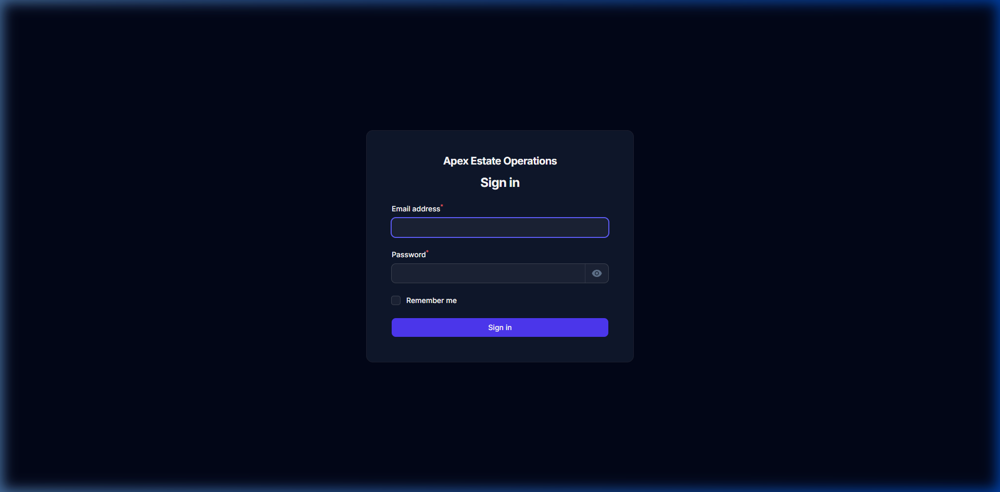
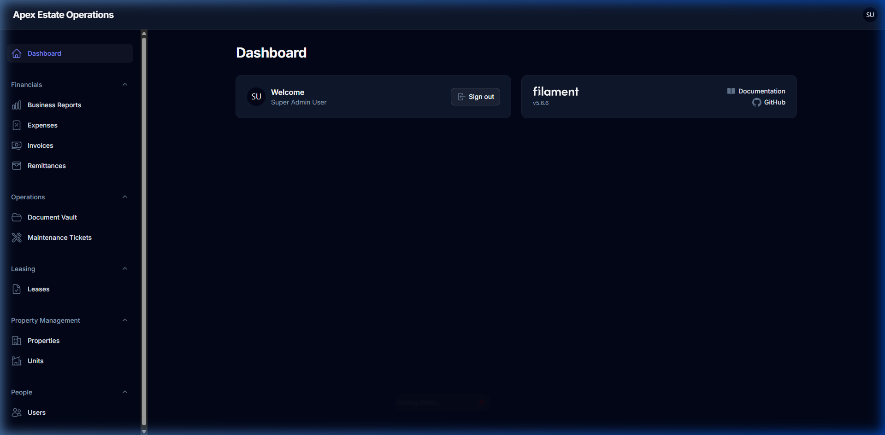
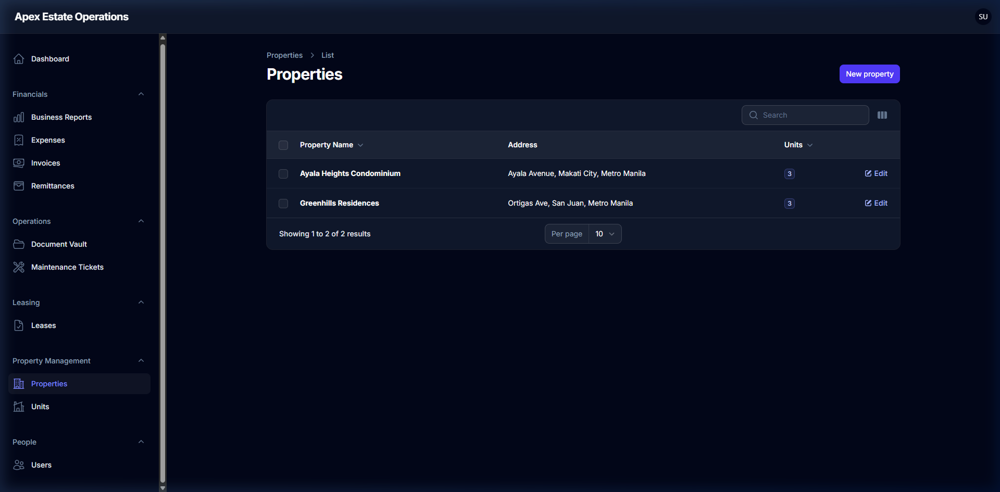
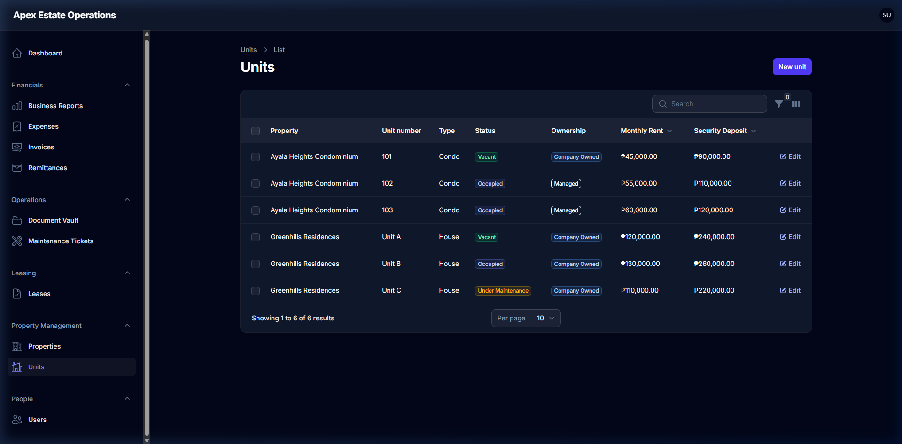
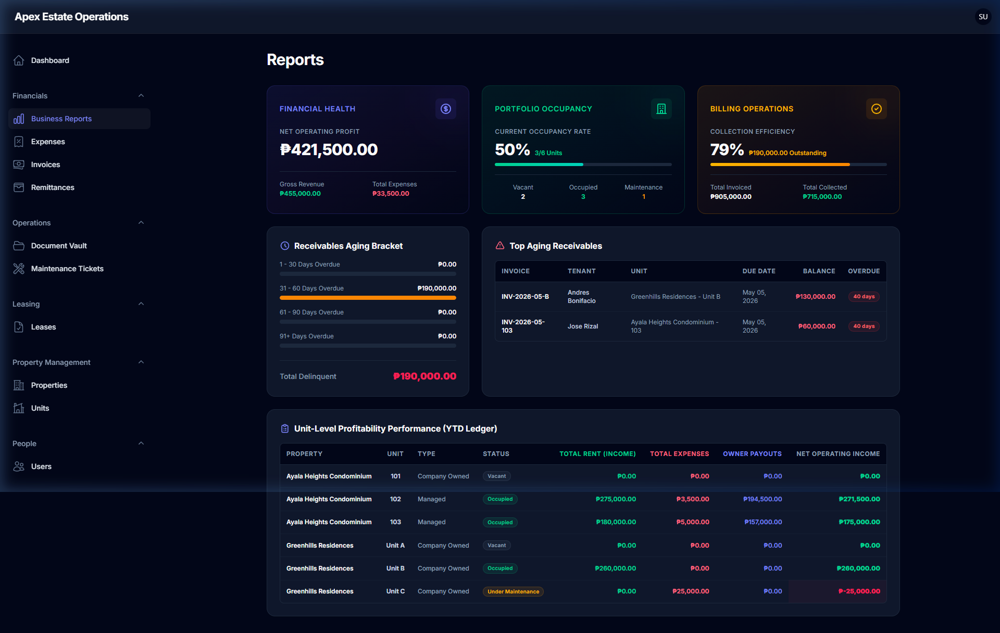
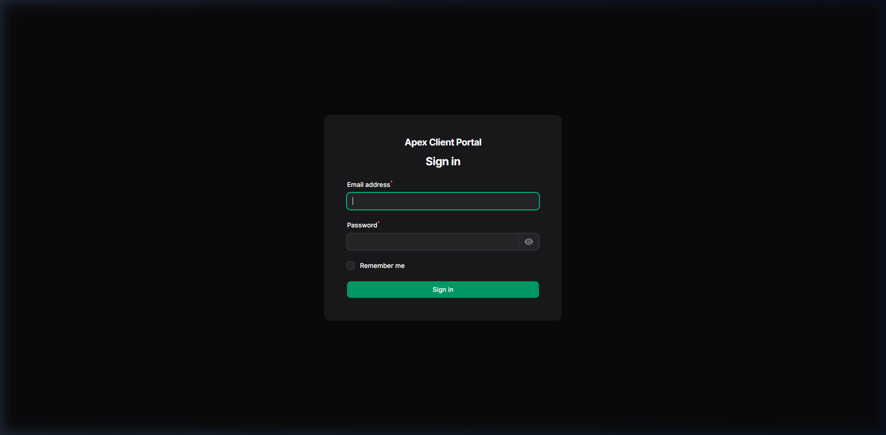
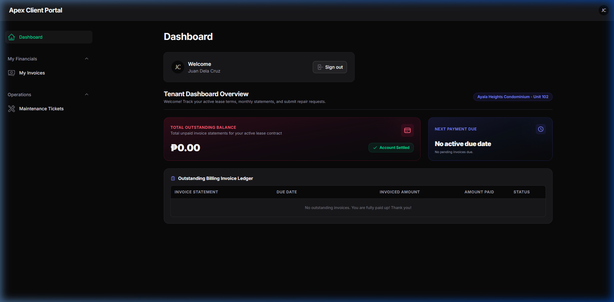
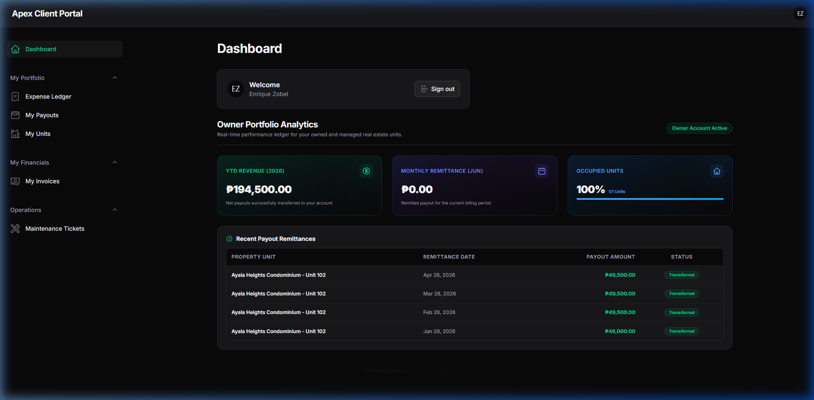

# Facebook Marketplace Listing Template: Real Estate & Property Management MVP

This folder contains marketing assets for selling or licensing the Real Estate Management System MVP. You can copy the content below and paste it directly into the Facebook Marketplace description field.

---

## 🏷️ Listing Details (Copy-Paste from here)

**Title Options:**
- 🏠 Premium Property Management System MVP (Laravel 13 & Filament v5)
- 🚀 Real Estate Management Portal - SaaS MVP Source Code
- 💻 Landlord & Tenant Portal App - Ready-to-Deploy Property Software

**Category:**
- Electronics & Computers > Software (or Service / Business for Sale)

**Price:**
- *[Enter your price, e.g., $499 or $999]*

---

### **Description:**

Looking for a modern, fully-featured **Property Management System** to launch your own real estate SaaS or manage your rental portfolio? Skip months of development and get started instantly with this premium MVP!

Built using the absolute latest web technologies (**Laravel 13, Filament PHP v5, Livewire v4, Tailwind CSS**), this system is clean, extremely fast, and highly customizable.

Whether you are a real estate agency, an independent landlord, or an entrepreneur looking to start a prop-tech business, this ready-to-deploy MVP is the perfect solution.

---

### ✨ Key Features:

#### 1. 👑 Powerful Admin Panel
- **Property & Unit Management:** Easily manage buildings, apartments, single-family homes, and individual unit details.
- **Lease Administration:** Draft and track leases with tenants, set move-in/out dates, security deposits, and contract terms.
- **Financial Tracking:** Seamlessly record rental invoices, track payments, log maintenance expenses, and process owner payouts.
- **User Role Control:** Multi-tier roles for System Admins, Landlords, Property Managers, Tenants, and Owners.

#### 2. 👥 Dedicated Client Portal
- **Tenant Portal:**
  - View rent balance, due dates, and detailed invoices.
  - Submit maintenance requests with priority levels and descriptions.
  - View lease documents and status.
- **Owner Portal:**
  - Support for multi-owner units with custom share percentages.
  - Real-time Year-To-Date (YTD) and monthly earnings dashboard.
  - Track unit-level expenses and transparent monthly remittances.
  - List of recent payouts/transfers.

#### 3. 📈 Advanced Business & Financial Reports
- **Occupancy Analytics:** Track vacant vs. occupied units and overall occupancy rate.
- **Collection Efficiency:** Monitor total due vs. paid amounts to optimize cash flow.
- **Profit & Loss Metrics:** Real-time visibility into total revenues, expenses, and net profit.
- **Aging Receivables:** See outstanding invoices grouped by 1-30, 31-60, 61-90, and 90+ days overdue.
- **Unit-level Profitability:** Analyze individual unit performance (Income vs. Expenses vs. Net).

---

### 💻 Modern Tech Stack:
- **Backend Framework:** Laravel 13 (Latest Version)
- **Dashboard UI:** Filament v5 (Fast, premium, and interactive)
- **Frontend Logic:** Livewire v4 & Alpine.js (Single-page app feel without API complexity)
- **Styling:** Tailwind CSS (Modern, mobile-responsive grids & layouts)
- **Database:** Fully compatible with MySQL, PostgreSQL, or SQLite.

---

### 📦 What is Included in the Sale:
- Full Source Code access (clean PHP 8.5/Laravel code).
- Comprehensive database seeders for testing (includes sample properties, leases, owners, and invoices).
- Basic setup and deployment instructions to host on your domain (compatible with Laravel Herd, Laravel Cloud, Forge, or standard VPS).
- Developer support for initial deployment (Optional/Negotiable).

Interested? Send a message to discuss licensing options, view a live demo, or purchase the complete source code!

---

## 📷 Screenshots Preview
*Note: Make sure to upload the high-resolution screenshots located in this directory when creating the listing.*

### 🖥️ Admin Panel & Dashboards

#### 1. Admin Login Page

#### 2. Admin Dashboard Overview

#### 3. Property Management

#### 4. Unit Inventory & Statuses

#### 5. Financial & Business Analytics Reports

### 📱 Tenant & Owner Portal

#### 6. Portal Login Page

#### 7. Tenant Dashboard (Payments & Maintenance Requests)

#### 8. Owner Revenue & Performance Dashboard

